<div align="center">



</div>

---

<div align="center">

### 👋 Welcome to my GitHub Profile!

I'm a passionate developer who loves building amazing things with code. Currently exploring the world of **web development** and **cloud technologies**.

</div>

## 🚀 About Me

- 🔭 I'm currently working on exciting web projects
- 🌱 Learning new technologies every day
- 👯 Looking to collaborate on open source projects
- 💬 Ask me about React, TypeScript, Node.js
- ⚡ Fun fact: I automate everything!

## 📈 GitHub Stats

<div align="center">


</div>

## 🛠️ Tech Stack

```typescript
const skills = {
  languages: ['JavaScript', 'TypeScript', 'Python'],
  frontend: ['React', 'Next.js', 'HTML/CSS', 'Tailwind'],
  backend: ['Node.js', 'Express', 'FastAPI'],
  databases: ['MySQL', 'PostgreSQL', 'MongoDB'],
  tools: ['Git', 'Docker', 'AWS', 'VS Code'],
  learning: ['Kubernetes', 'GraphQL', 'Rust']
};
```

## 📫 Connect With Me

<div align="center">

[](https://github.com/Dineshs737)
[](https://linkedin.com/in/yourprofile)
[](https://twitter.com/yourhandle)

</div>

---

<div align="center">

**Last Updated:** October 20, 2025

*This README is automatically updated using GitHub Actions* ⚡

</div>