# 🎨 Animated GitHub Profile Generator

<div align="center">


**Create a stunning, auto-updating GitHub profile with real-time stats!**

[View Demo](https://github.com/Dineshs737) · [Report Bug](https://github.com/Dineshs737/github-profile-generator/issues) · [Request Feature](https://github.com/Dineshs737/github-profile-generator/issues)

</div>

---

## ✨ Features

- 🎯 **Real-time GitHub Statistics** - Automatically fetches your latest stats
- 🎨 **Animated SVG Profile Card** - Eye-catching design with smooth animations
- 🔄 **Auto-Updates** - Runs every 3 hours via GitHub Actions
- 📊 **Comprehensive Metrics** - Repos, followers, commits, PRs, issues, stars, and more
- 🛠️ **Tech Stack Showcase** - Display your favorite technologies with animated badges
- 🎭 **Fully Customizable** - Easy to modify colors, layout, and content
- 🚀 **Zero Maintenance** - Set it and forget it!

---

## 📸 Preview



---

## 🚀 Quick Start

### Prerequisites

- A GitHub account
- Node.js 18+ (for local testing)
- Basic knowledge of Git

### Step 1: Create Your Profile Repository

1. Create a **new repository** with the same name as your GitHub username
   ```
   Example: If your username is "johndoe", create repo "johndoe"
   ```
2. Make it **public**
3. Initialize with a README (will be replaced)

### Step 2: Clone This Repository Structure

```bash
# Clone your profile repository
git clone https://github.com/YOUR_USERNAME/YOUR_USERNAME.git
cd YOUR_USERNAME

# Create folder structure
mkdir -p .github/workflows src
```

### Step 3: Copy Files

Copy these files from this repository:

```
YOUR_USERNAME/
├── .github/workflows/
│   └── update-profile.yml
├── src/
│   └── index.ts
├── package.json
├── tsconfig.json
└── .gitignore
```

### Step 4: Install Dependencies

```bash
npm install
```

### Step 5: Create GitHub Personal Access Token

1. Go to [GitHub Settings → Tokens](https://github.com/settings/tokens)
2. Click **Generate new token (classic)**
3. Name: `Profile Auto-Updater`
4. Select scopes:
   - ✅ `repo` (all)
   - ✅ `read:user`
   - ✅ `user:email`
5. Click **Generate token**
6. **Copy the token** (save it securely!)

### Step 6: Add Repository Secret

1. Go to your repository: `github.com/YOUR_USERNAME/YOUR_USERNAME`
2. Click **Settings** → **Secrets and variables** → **Actions**
3. Click **New repository secret**
4. Name: `GH_TOKEN`
5. Value: Paste your token
6. Click **Add secret**

### Step 7: Customize Your Profile

Edit `src/index.ts` to customize:

```typescript
// Change your information
const stats = {
  name: "Your Name",
  username: "yourusername",
  location: "Your City, Country",
  bio: "Your Job Title",
  company: "@YourCompany",
  // ... more customization
};
```

### Step 8: Test Locally (Optional)

```bash
# Build
npm run build

# Generate (requires token)
export GITHUB_TOKEN=your_token_here
npm run generate

# Check generated files
ls -la profile.svg README.md
```

### Step 9: Deploy

```bash
git add .
git commit -m "🎉 Setup automated profile generator"
git push origin main
```

### Step 10: Trigger First Run

1. Go to **Actions** tab in your repository
2. Click **Update GitHub Profile**
3. Click **Run workflow** → **Run workflow**
4. Wait 1-2 minutes

**🎉 Done!** Visit `github.com/YOUR_USERNAME` to see your new profile!

---

## 🎨 Customization Guide

### Change Update Frequency

Edit `.github/workflows/update-profile.yml`:

```yaml
schedule:
  - cron: '5 */3 * * *'  # Every 3 hours (default)
  # - cron: '5 */6 * * *'  # Every 6 hours
  # - cron: '5 0 * * *'    # Daily at midnight
  # - cron: '5 9,21 * * *' # Twice daily (9 AM, 9 PM)
```

### Customize Colors

In `src/index.ts`, find and modify color codes:

```typescript
// Background colors
fill="#0d1117"  // Dark background
fill="#161b22"  // Card background

// Accent colors
stroke="#58a6ff"  // Blue accent
fill="#238636"   // Green
fill="#8957e5"   // Purple
```

### Add/Remove Technologies

Find the "Tech Stack" section in `generateSVG()`:

```typescript
// Add your tech stack
<g transform="translate(0, 0)">
  <rect width="95" height="32" rx="8" fill="#0d1117" stroke="#YOUR_COLOR"/>
  <text fill="#YOUR_COLOR">Your Tech</text>
</g>
```

### Modify Stats Display

Edit the `collectStats()` method to change what data is shown:

```typescript
// Add new stats
const customStat = await this.fetchCustomData();

// Modify existing stats calculation
const commits = await this.fetchCommitCount() * 2; // Double it
```

### Change Profile Card Layout

Modify the SVG structure in `generateSVG()`:

```typescript
// Move sections around
<g transform="translate(x, y)">  // Change x, y coordinates
  <!-- Your content -->
</g>
```

---

## 📁 Project Structure

```
github-profile-generator/
├── .github/
│   └── workflows/
│       └── update-profile.yml    # GitHub Actions workflow
├── src/
│   └── index.ts                  # Main generator code
├── dist/                         # Compiled JavaScript (auto-generated)
├── package.json                  # Dependencies
├── tsconfig.json                 # TypeScript config
├── .gitignore                   # Git ignore rules
├── profile.svg                   # Generated profile card
└── README.md                     # Generated profile README
```

---

## 🛠️ Available Scripts

```bash
npm run build      # Compile TypeScript to JavaScript
npm run generate   # Generate profile files
npm run dev        # Run in development mode
```

---

## 🔧 Troubleshooting

### Workflow Not Running

**Problem:** Scheduled workflow doesn't trigger

**Solutions:**
1. Make sure repository is active (commit every 60 days)
2. Check if workflow is enabled in Actions tab
3. Verify workflow file is on main/master branch
4. GitHub Actions can have 3-15 minute delays

### Token Error

**Problem:** `GITHUB_TOKEN environment variable is required`

**Solutions:**
1. Verify `GH_TOKEN` secret exists in repository settings
2. Check token hasn't expired
3. Ensure token has correct permissions (`repo`, `read:user`)

### Files Not Committing

**Problem:** Workflow runs but README.md not updated

**Solutions:**
1. Check Actions logs for commit step
2. Verify workflow has write permissions
3. Ensure files are actually being generated (check logs)
4. Try manual trigger: Actions → Run workflow

### Build Fails

**Problem:** `tsc: command not found` or TypeScript errors

**Solutions:**
```bash
npm install          # Reinstall dependencies
npm run build        # Build again
```

Check `tsconfig.json` exists and is valid.

### Rate Limiting

**Problem:** `API rate limit exceeded`

**Solutions:**
1. Reduce update frequency (every 6 hours instead of 3)
2. Check token is being used (provides 5000 req/hour)
3. Wait for rate limit to reset (shown in error message)

---

## 🤝 Contributing

Contributions are welcome! Here's how you can help:

1. 🍴 Fork the repository
2. 🔨 Create your feature branch (`git checkout -b feature/AmazingFeature`)
3. 💾 Commit your changes (`git commit -m 'Add some AmazingFeature'`)
4. 📤 Push to the branch (`git push origin feature/AmazingFeature`)
5. 🎉 Open a Pull Request

### Ideas for Contributions

- 🎨 New profile card designs/themes
- 📊 Additional statistics and metrics
- 🌐 Multi-language support
- 🎭 Dark/light mode toggle
- 📱 Responsive designs
- 🔌 Integration with other services (WakaTime, LeetCode, etc.)

---

## 📊 Stats & Metrics Tracked

| Metric | Description | Source |
|--------|-------------|--------|
| **Repositories** | Total public repos | GitHub API |
| **Followers** | Profile followers | GitHub API |
| **Following** | Accounts you follow | GitHub API |
| **Commits** | Commits this year | Estimated from recent activity |
| **Pull Requests** | PRs merged | GitHub Search API |
| **Issues** | Issues opened | GitHub Search API |
| **Stars** | Total stars earned | Sum across all repos |
| **Streak** | Current contribution streak | Calculated from events |
| **Lines of Code** | Estimated total | Based on repo activity |

---

## 🎓 How It Works

1. **GitHub Actions Trigger**: Runs on schedule (every 3 hours by default)
2. **Data Fetching**: Uses Octokit to fetch your GitHub statistics
3. **SVG Generation**: Creates an animated SVG profile card
4. **README Creation**: Generates a markdown README with stats
5. **Auto-Commit**: Commits and pushes changes to repository
6. **Profile Update**: GitHub automatically displays the updated profile

### Workflow Diagram

```
┌─────────────────┐
│  GitHub Actions │
│   (Every 3hrs)  │
└────────┬────────┘
         │
         ▼
┌─────────────────┐
│  Fetch GitHub   │
│   Statistics    │
└────────┬────────┘
         │
         ▼
┌─────────────────┐
│   Generate SVG  │
│  & README.md    │
└────────┬────────┘
         │
         ▼
┌─────────────────┐
│  Commit & Push  │
│   to Repo       │
└────────┬────────┘
         │
         ▼
┌─────────────────┐
│  Profile Updates│
│   Automatically │
└─────────────────┘
```

---

## 📚 Documentation

### API Reference

#### GitHubProfileGenerator Class

```typescript
class GitHubProfileGenerator {
  constructor(token: string, username: string)
  
  async fetchUserData(): Promise<any>
  async fetchRepositories(): Promise<any[]>
  async fetchCommitCount(): Promise<number>
  async fetchPullRequestCount(): Promise<number>
  async fetchIssueCount(): Promise<number>
  async fetchTotalStars(): Promise<number>
  async calculateStreak(): Promise<number>
  async collectStats(): Promise<GitHubStats>
  
  generateSVG(stats: GitHubStats): string
  generateREADME(): string
  
  async generate(): Promise<void>
}
```

### Configuration Options

Create a `config.json` (optional):

```json
{
  "updateFrequency": "*/3 * * * *",
  "theme": {
    "backgroundColor": "#0d1117",
    "accentColor": "#58a6ff",
    "textColor": "#c9d1d9"
  },
  "features": {
    "showCommits": true,
    "showPRs": true,
    "showIssues": true,
    "showStreak": true
  }
}
```

---

## 🌟 Examples

Check out these amazing profiles using this generator:

- [@Dineshs737](https://github.com/Dineshs737) - Original creator
- Add your profile here by opening a PR!

---

## 💡 Advanced Usage

### Custom Themes

Create your own theme:

```typescript
const theme = {
  background: '#1a1b27',
  card: '#24283b',
  accent: '#7aa2f7',
  text: '#c0caf5',
  green: '#9ece6a',
  red: '#f7768e',
  yellow: '#e0af68',
  purple: '#bb9af7'
};
```

### Multiple Profiles

Generate different profiles for different contexts:

```bash
# Work profile
npm run generate -- --config=work-config.json

# Personal profile  
npm run generate -- --config=personal-config.json
```

### Integration with Other Services

Add WakaTime coding stats:

```typescript
// In src/index.ts
async fetchWakaTimeStats(): Promise<WakaTimeData> {
  // Implementation
}
```

---

## ⚠️ Important Notes

- 🔒 **Never commit your GitHub token** to the repository
- 📊 Some stats are estimated based on recent activity (GitHub API limitations)
- ⏰ GitHub Actions cron can be delayed 3-15 minutes
- 🚫 Scheduled workflows disabled after 60 days of repo inactivity
- 📝 Generated README.md will overwrite any existing README
- 🔄 First-time setup may take 5-10 minutes for workflow to complete

---

## 🔐 Security

- ✅ Token stored as repository secret (encrypted)
- ✅ Token only accessible by GitHub Actions
- ✅ No token exposed in logs or code
- ✅ Follows GitHub security best practices
- ✅ Read-only access to public data

---

## 📜 License

This project is licensed under the MIT License - see the [LICENSE](LICENSE) file for details.

```
MIT License

Copyright (c) 2024 Uthayakumar Dinesh

Permission is hereby granted, free of charge, to any person obtaining a copy
of this software and associated documentation files (the "Software"), to deal
in the Software without restriction, including without limitation the rights
to use, copy, modify, merge, publish, distribute, sublicense, and/or sell
copies of the Software, and to permit persons to whom the Software is
furnished to do so, subject to the following conditions:

The above copyright notice and this permission notice shall be included in all
copies or substantial portions of the Software.

THE SOFTWARE IS PROVIDED "AS IS", WITHOUT WARRANTY OF ANY KIND, EXPRESS OR
IMPLIED, INCLUDING BUT NOT LIMITED TO THE WARRANTIES OF MERCHANTABILITY,
FITNESS FOR A PARTICULAR PURPOSE AND NONINFRINGEMENT.
```

---

## 🙏 Acknowledgments

- [GitHub REST API](https://docs.github.com/en/rest) - For providing comprehensive API
- [Octokit.js](https://github.com/octokit/octokit.js) - GitHub API client
- [GitHub Actions](https://github.com/features/actions) - CI/CD platform
- All contributors who help improve this project

---

## 📞 Support

- 🐛 [Report Issues](https://github.com/Dineshs737/github-profile-generator/issues)
- 💬 [Discussions](https://github.com/Dineshs737/github-profile-generator/discussions)
- ⭐ [Star this repo](https://github.com/Dineshs737/github-profile-generator) if you find it useful!

---

## 🚀 Roadmap

- [ ] Add theme presets (dark, light, colorful)
- [ ] Support for custom badges
- [ ] Integration with WakaTime
- [ ] LeetCode stats integration
- [ ] Portfolio project showcase
- [ ] Blog post integration
- [ ] Social media links
- [ ] Visitor counter
- [ ] Language statistics charts
- [ ] Activity heatmap

---

<div align="center">

**⭐ Star this repo if you found it helpful!**

Made with ❤️ by [Dineshs737](https://github.com/Dineshs737)

[⬆ Back to Top](#-animated-github-profile-generator)

</div>
